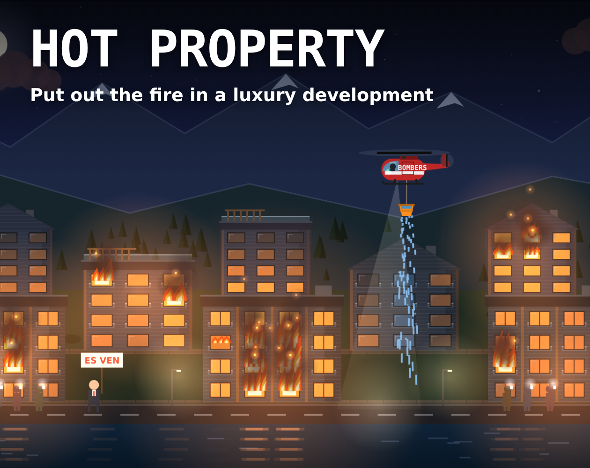

# Hot Property

<p align="center">
    <a href="https://edulazaro.itch.io/hot-property"></a>
    <a href="https://github.com/edulazaro/hot-property/actions/workflows/tests.yml"></a>
    <a href="https://github.com/edulazaro/hot-property/blob/main/package.json"></a>
    <a href="https://react.dev"></a>
    <a href="https://www.typescriptlang.org"></a>
    <a href="https://github.com/edulazaro/hot-property/blob/main/LICENSE.md"></a>
</p>

Arcade firefighting game set at night in a luxury housing development in Ordino, Andorra. Fly a firefighting helicopter, fill its bucket in the river and drop the water on the burning flats before half of La Cremola goes up in smoke, while the wind keeps changing, the old men comment from the road and the estate agent keeps trying to sell.



**[Play it in your browser on itch.io](https://edulazaro.itch.io/hot-property)**. Works on desktop and mobile, in English, Spanish and Catalan.

## How to play

| | Desktop | Mobile |
|---|---|---|
| Fly | Arrows or WASD | Drag your finger anywhere |
| Drop water | Hold Space or the mouse button | Hold the WATER button |
| Pause | P or Esc | Pause button |
| Mute | M | Sound button |

- Dip the bucket in the river to fill it. It hangs from a rope and swings as you fly.
- Fire climbs from floor to floor and jumps to the next buildings, faster downwind. Wet windows don't catch fire for a while.
- Drops fall with gravity and drift with the wind, and soak every window they pass through.
- Smoke above the fire damages the helicopter: fly lower to aim better, higher to stay safe.
- Every now and then the French firefighters arrive and hose down the front row.
- A fire service truck brings slightly bigger buckets: touch the one on its bed with yours to swap. They come full, but take longer to fill.
- There's always something burning, and every 30 seconds the level goes up: new fires start more often and the wind gets stronger. When half the complex's value has burnt, it's over.

On phones the game plays fullscreen in landscape.

## Development

Requires Node 24 and pnpm.

```bash
pnpm install
pnpm dev          # web page version at http://localhost:5303
pnpm dev:itch     # itch.io version (only the game, filling the viewport)
pnpm check        # types + lint/format (Biome) + tests (Vitest)
pnpm build        # production build in dist/
pnpm build:itch   # dist-itch/ and hot-property-itch.zip, ready to upload to itch.io
```

## Project structure

```
src/
  game/      game logic without React or canvas (layout, state, rules, texts, tests)
  render/    canvas drawing, reads the state and never changes it (theme.ts has every color and font)
  shell/     reusable shell: fixed 60 Hz loop, fullscreen/landscape handling, pause, menus, audio, music, i18n
  music/     background music tracks
  sounds.ts  every sound effect, synthesized with the Web Audio API
  rotor.ts   continuous rotor sound, synthesized
  Game.tsx   React layer: screens and input
itch/        cover, screenshots and store page text
```

Stack: Vite, React 19, TypeScript, Tailwind CSS v4. No game engine: everything is drawn with the Canvas 2D API and every sound effect is synthesized. The background music was made with Suno.

## Embedding

The game can be placed in another site with an iframe. The host can fix the language, which hides the in-game language selector:

```html
<iframe src="https://example.com/hot-property/?lang=es" width="960" height="540" allow="fullscreen"></iframe>
```

```js
// Change the language later from the parent page
iframe.contentWindow.postMessage({ type: "set-locale", locale: "ca" }, "*");
```

Without `?lang`, the game uses the player's last choice or the browser language (English unless Spanish or Catalan).

Every [GitHub release](https://github.com/edulazaro/hot-property/releases) includes `hot-property-itch.zip`, the built game ready to serve from any static host.

## Sponsors

Hot Property is supported by the following sponsors. Thank you for keeping it growing:

<p>
  <a href="https://andorradev.com"></a>&nbsp;<a href="https://andorradev.com">AndorraDev</a>&nbsp;&nbsp;&nbsp;&nbsp;
  <a href="https://andorranos.com"></a>&nbsp;<a href="https://andorranos.com">Andorranos</a>&nbsp;&nbsp;&nbsp;&nbsp;
  <a href="https://andorrawork.com"></a>&nbsp;<a href="https://andorrawork.com">AndorraWork</a>
</p>

## Author

Created by [Edu Lazaro](https://edulazaro.com)

## License

Hot Property is open-sourced software licensed under the [MIT license](LICENSE.md). The music in `src/music/` is not covered by this license.
